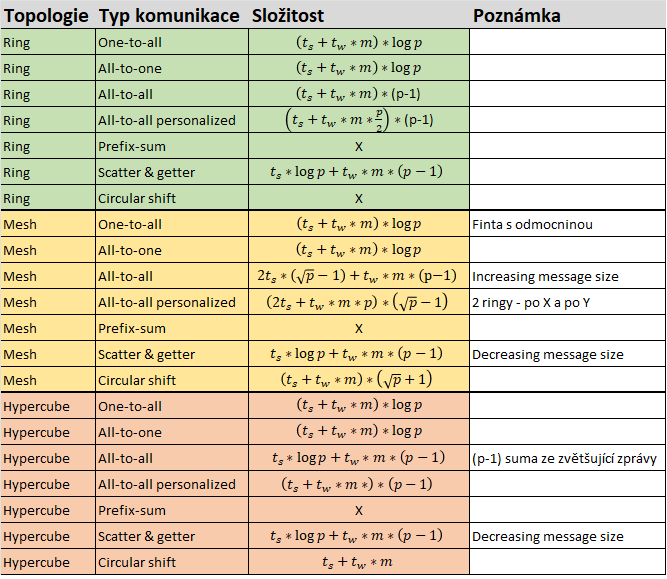

# 2. přednáška
## Tasky
- Při návrhu paralelního algoritmu musím prvně zadefinovat **tasky**, které se provádí paralelně
- Tasky se velikostně liší
- **Task dependency graph** - DAG - vyjadřuje závislost prováděných tasků
- **Granuality** - množství tasků, do kterých problém dekompunuju
- **Fine-grained decomposition** - velké množství tasků
- **Coarse grained decomposition** - malé množství tasků

## Pojmy
- **Degree of concurrency** - Počet tasků, které mohou být prováděny paralelně
- **Maximum degree of concurrency** - Maximální počet tasků, které mohou být prováděny paralelně
- **Average degree of concurrency** 
  - Průměrný počet tasků, které mohou být prováděny paralelně po dobu běhu algoritmu
  - Počet tasků / critical path length
- Degree of concurrency je závislé na granuality
- **Critical Path Length** - Nejdelší možná cesta, kterou běh algoritmu vykoná v rámci task dependency graphu
- Granualitu nelze snižovat do konečna - každý problém má *maximální možnou granualitu*
- Tasky spolu musí často komunikovat -> overhead - přílišná granualita nemusí být žádoucí

### Příklad

- (a)
  - Critical path length - 3 (4 nebo 3 -> 6 -> 7)
  - Shortest parallel execution time - 27
  - Processors count for minimum parallel execution time - 4
  - Maximum degree of concurrency - 4
  - Average degree of concurrency - 7/3 ❓
- (b)
  - Critical path length - 4 (2 nebo 1 -> 5 -> 6 -> 7)
  - Shortest parallel execution time - 28
  - Processors count for minimum parallel execution time - 2
  - Maximum degree of concurrency - 4
  - Average degree of concurrency - 7/4 ❓

## Task Interaction Graphs
- Graf komunikace tasků
- Tasky spolu často musí komunikovat (vyměňovat data), tuto komunikaci lze znázornit grafem

### Příklad
- Představme si násobení sparse matice **A** vektorem **b**
- Potřebujeme násobit pouze nenulové prvky z matice **A** (znázorněno černou tečkou)
- Každý task má přiřazen řádek matice **A** a jeden prvek vektoru **b**
- Např. pro provedení násobení prvního řádku se musíme doptat tasků 1,4,8 na jeho prvek z **b**, protože náš řádek zde obsahuje nenulové číslo a my ho potřebujeme vynásobit s příslušným prvkem z *b*, který náš task ale nezná

## Techniky dekompozice
Jak dekomponujeme problém na tasky?

Rozlišujeme čtyři základní techniky
1. [Recursive decomposition](#recursive-decomposition)
2. [Data decomposition](#data-decomposition)
3. [Exploratory decomposition](#exploratory-decomposition)
4. [Speculative decomposition](#speculative-decomposition)

### Recursive decomposition
- Vhodná pro problémy divide-and-conquer (eg. quick sort)
- Rekursivně dekomponujeme problém dokud nedosáhneme požadované granuality

#### Příklad
Quicksort
- Každý sub-list může být rekurzivně zpracováván paralelně

Hledání minima v listu
- Můžeme to pochopitelně dělat sériově
- Paralelně list 4,9,1,7,8,11,2,12 můžeme zpracovat následovně

### Data decomposition
- Spoléha na charakteristiku dat, s kterými algoritmus pracuje
- Dekompunujeme tyto data na jednotlivé tasky
- Volba dekompozice značně ovlivňuje výkon algoritmu
- Více přístupů
    1. Output data partitioning
    2. Input data partitioning
    3. Intermediate data partitioning

#### Output Data Decomposition
- Element výsledku je spočten nezávisle na ostatních výsledcích
- Pro stejný problém může existovat více output dekompozic

##### Příklad
Násobení dvou matic
- Každý výsledek **C** je nzávislý na ostatních **C**

Itemset
- Chceme spočítat počet výskytů itemsetu v databázi transakcí (a)
- To můžeme dekomponovat, tak že rozdělíme itemsety do více tasků (b)
- Nepotřebujeme žádnou komunikaci mezi tasky

#### Input Data Partitioning
- Výstup je spočten jako funkce ze vstupu
- V mnoha případech jediná možná dekomnozice - nevíme co je výstup (např. hledání minima, sort listu)
- Tasku je přiřazena část vstupních data

##### Příklad
Itemset
- Rozdělíme databázi transakcí do více tasků
- Výsledky z jednotlivých tasků poté agregujeme do konečného výsledku

#### Input and Output Data Partitioning
- Kombinace obou přístupů

#### Intermediate Data Partitioning 
- Sekvence transformací ze vstupních na výstupní data
- Počítáme "mezivýsledky" které následně tranformuje na výsledek
- Často přívější task dependency graph -> rychlejší

### Exploratory Decomposition
- Dekompozice probíhá společně s průběžnými výpočty
- Použitelmé pro problémy které zahrnují explorativní hledání v prostoru řešení
  - 0/1 integer programming
  - QAP - Quadratic assignment problem
  - Theorem proving
  - Hry (např. šachy)

#### Příklad
15 puzzle
- Posouváme prvky v 2d gridu tak, aby byly seřazené
- Paralelně můžeme v rámci každého tasku počítat všechny možné kroky a najít ty, které jsou správné (na obrázku je správný výsledek podbarven šedě)

#### Anomalous Computations 
- V mnoha případech může explorativní dekompozice měnit množství vykonané práce v širokém rozsahu
- Tzn. že může stejný algoritmus být pro nějaké instance velmi rychlý (sublinear speedup) a pro jiné velmi pomalý (superlinear speedup)❓

### Hybrid Decompositions 
- Mix dekompozičních technik
- Často nutný pro dekompozici problémů
- Quicksort 
   - Pouze rekurzivní dekompozice limituje maximální možnou paralelizaci
   - Lepší je použít mix data a rekurzivní dekompozice
   - To je způsobeno tím, že ❓ (hádám, že lepší než pivotovat dlouhý list je lepší to prostě rozesrat na víc procesorů rovnou)
 - Hledání minima
   - Opět je lepší použít mix data a rekurzivní dekompozice

## Tasky
- Problém dekomponujeme na tasky
- Charakteristictika těchto tasků značně ovlivňuje výkon algoritmu
- Faktory:
  - **Task generation (Generování tasků)** - Jak je tvoříme
  - **Task sizes (Velikost tasků)** - Jak jsou tasky velké
  - **Size of data associated with tasks (Množství asociovaných dat)** - Kolik dat jednotlivé tasky zpracovávají

### Task generation (generování tasků)
#### Static task generation
- Víme, kolik tasků bude potřeba na začátku běhu algoritmu
- Např. maticové operace, grafové algortimy, zpracovávání obrázků
- Pravidelně strukturované problémy

#### Dynamic task generation:
- Generujeme tasky v průběhu běhu algoritmu
- Např. 15 puzzle board
- Exploratory nebo speculative decomposition

### Task sizes
#### Uniform
- Jednotná velikost tasků
#### Non-uniform
- Různě velké tasky
- Nevíme, jak budou tasky velké
- Např. discrete optimization problems

### Mapping Techniques
- Tasky musíme přidělovat (mapovat) na fyzické procesory (jádra)
- Toto musí být uděláno chytře
- Minimalizujeme overheads
  - Způsobený komunikací
  - Způsobený nečiností (nepřidělenou prací) některého procesoru
- Minimalizace je optimalizační problém a často si odporuje - např. přidělením celé práce jedinému procesoru minimalizuje komunikace, lale způsobí nečinost všech ostatních procesorů

#### Mapping Techniques for Minimum Idling
 - Musíme současně minimalizovat indling a provádět load balancing
 - Pouhý loadbalancing neminimalizuje idling!
 - Mapování je ovlivěno velikostí tasků, zpsůbem generování, velikostí asociovaných dat
 - Případ (a) je otpimální, případ (b) není

Dva základní přístupy
1. Static mapping (statické mapování)
   - Předem určíme který task bude zpracovávat jaký procesor
   - Musíme znát (nebo alespoň odhadnout) velikost tasků
   - Stejně se jedná většinou o NP-complete problém
2. Dynamic Mapping
   - Tasky přidělujeme po dobu běhu
   - Použijeme když např. generujeme tasky za běhu nebo neznáme jejich velikost

Komplexita
- Obecně se často jedná o NP-Complete problém
- Tasky mají závislosti
  - Na jeden procesor - P
  - Uniform tasky na 2 a více procesorů - NP-complete
  - Non-uniform tasky na 2 a více procesorů - NP-Complete
- Bez závislostí
  - Na jeden procesor - P
  - Non-uniform tasky na 2 a více procesorů - NP-complete
  - Uniform tasků na 2 a více procesorů - P

### Schemes for Static Mapping 
#### Mappings Based on Data Partitioning
TODO

# 3. přednáška
## Přehled vzorců

## Komunikace mezi tasky 
- Je třeba implementovat efektivně
- Musí vycházet z architektury použitého paralleního systému
- Skupinová komunikace je realizována jako více point-to-point zpráv
- Poslání zprávy o velikosti *m* zabere na nezahlcené síti *t_s + t_w \* m*
- Tato metrika je použitá k měření rychlosti komunikace
- Pakliže potřebujeme počítat se zahlcenou sítí -> zvyšujeme *t_w*
- Předpokládáme, že komunikační síť je obousměrná a jednoportová

## One-to-All Broadcat
- Jeden procesor zasílá data o velikosti *m* všem ostatním procesorů

## All-to-One Reduction
- Všechny procesory zasílají zprávu o velikosti *m* jednomu procesoru
- Tyto data jsou na "centrálním" procesoru agregovány použitím asociativní operace (např. plus, minimum)

## One-to-All Broadcats / All-to-One Reduction
### Ring
- Broadcast - K poslání *p - 1* zpráv použijeme rekurzivní dvojení (recursive doubling)
  - Zdrojový procesor odešle zprávu na první procesor. Nyní mají oba dva tyto procesory na starosti pouze půlku ze všech procesorů

- Redukce - Obdobný princip ale naopak

### Mesh
- Čtvercová matice *p* procesorů má sqrt(p) sloupců a řádků
- Broadcast a redukce má dva kroky
    1. Rozšíříme zprávu po řádce
    2. Následně posíláme zprávu paralelně po sloupcích
- Zobecnění tohoto postupu funguje ve více dimensích

#### Příklad
- Násobíme matici *A* vektorem *v*
- Musíme provést nejprve one-to-all broadcast a následně all-to-one redukci
- Čárkované šipky znázorňují směr komunikae
- Vidíme, že každý procesor P má přidělený čtvercový kus dat matice *A* a jeden prvek vektoru *v*
- Pro provedení výpočtu musí tedy kupříkladu procesor P_0 poslat svůj prvek vektoru *A* na procesor P_4, P_8 a P_12
- Následně kupříkladu procesory P_1, P_2, P_3 zaslšou data procesoru P_0 který provede agregaci sečtením

### Hypercube
- K hypercube s 2^d nody můžeme přistupovat jako k d-dimensionální meshi (dva vrcholy na dimensi)
- Mesh algoritmus můžeme generalizovat k použití na hypercube s d = log(p) kroky

### Algoritmy pro broadcasts a reductions
- Všechny výše zmíněné příklady komunikace (viz. obrázky) používají stejný princip
- Algoritmus může být snadno přizpůsoben i pro další topologie

**One to all**

**All to one**

### Cost analysis
- Broadcast i redukce potřebuje log p point-to-point zaslaných zpráv, kde kadžá stojí poslat t_s + t_w*m
- Celková cena je tedy: T = (t_s + t_w\*m) * log(p)

## All-to-All Broadcats
- Generalizace přechozího, kde každý procesor vysílá i příjímá zprávy současně
- V rámci procesu každý procesor pošle stejnou zprávu velikosti m všem ostatním procesorům
- Různé procesy mohou posílat různé zprávy

### Ring
- V prvním kroku zašle každý procesor svoji zprávu sousedícímu procesoru pro směru hodinových ručiček
- V každém dalším vždy pošle své a data které již obdržel v přechozích krocích
- Algoritmus končí po p-1 krocích

### Mesh
- Dva kroky
  1. Každá řádka mřížky provede all-to-all broadcast mezi sebou "lineárně" - každý node získa sqrt(p) zpráv
  2. Každý node rozšíří přijaté zprávy jako zprávu velikosti m*sqrt(p) po sloupci

### Hypercube
- Zobecnění mesh algoritmu pro log p dimensí
- Velikost zpráv se zdvojnásobuje s každým z log(p) kroků

## All-to-All Reduction
- Podobné jako pro all-to-all broadcast, pořadí je opačné
- Při přijetí zprávy ji musí node zkombinovat s lokální kopií zprávy, která má stejnou destinaci jako zpráva přijatá
- Po zkombinování je zpráva zaslána sousedovi

### Cost analysis
- **Kruh** - T = (t_s + t_w * m)*(p-1)
- **Mesh** - T = 2 * t_s * (sqrt(p) - 1) + t_w * m * (p-1)
- **Hypercube** - T = t_s * log(p) + t_w * m * (p-1)

## All-reduce
- Kadžý node začíná s bufferem o velikosti m
- Výsledkem je buffer velikosti m na každém nodu, který obsahuje agregovaná data ze všech nodů za pomocí asociativní operace
- Shodné jako all-to-one reduction s následným one-to-all broadcastem (to je méně efektivní ❓)
- Vhodnější je použít all-to-all broadcast, kde se nezvětšuje velikost zprávy
- T = (t_s + t_w * m) * log(p)
- Rozdíl od all-to-all - neprobíhá p souběžných all-to-one redukcí, každá s jiným cílem výsledku

## Prefix-Sum
- Mějme p čísel n_0, n_1,...,n_p-1 (každé na jiném nodu), chceme spočíst sumu těchto čísel pro *od 0 pk*, kde *k* je v rosahu 0 až p-1
- Jinými slovy chceme sečíst rozsah z čísel *n_x* kde x \el {0,...,k}
- Suma nahradí prvek n_k

## Scatter and Gather
- Dva kroky
  1. Scatter - Jeden node zašle unikátní zprávu velikosti *m* všem ostatním nodům (one-to-all personalized)
  2. Getter - Jeden node sbírá unikátní zprávy od všech ostatních
- Ačkoli je principielně scatter operace jiná než broadcast, algoritmicky se podobají až na velikost zprávy (zprávy se změnšují u scatteru, ale zůstávají stejné u broadcastu)
- Getter operace je inverzní operací scatteru

### Cost analysis
- Dochází k log(p) kroků, v každém kroku se půlí velikost zprávy stejně tak jako pomyslná velikost zbývajího stroje
- T = t_s * log(p) + t_w * m * (p-1)
- Toto platí pro linární pole a 2-D mesh
- Tyto časy jsou asymprocky optimální ve velikosti zpráv

## All-to-All Personalized Communication 
- Jinak známo jako total exchange
- Každý node má odlišnou zprávu velikosti *m* pro každý další node
- Nezaměňovat s all-to-all broadcastem, kde každý node posílá stejnou zprávu!

### Příklad
- Transponování matice
- Každý procesor obsahuje řádek matice
- Transponování tak vyžaduje all-to-all personalizovanou komunikaci

### Ring
- Postup:
  1. Každý node pošle všechna data jako jednu zprávu o velikosti m * (p-1) jednomu ze sousedů
  2. Každý node si vybere zprávu určenou pro něj a zbytek pošle dál
- Algortimus končí za p - 1 kroků
- Zpráva se každý další krok zmenšuje o *m*

#### Cost
- Máme p -1 kroků
- v i-tém kroku je velikost zprávy m * (p - i)
- 
- Člen t_w může být dělen 2 pomocí obousměrné komunikace ❓

### Mesh
- Postup:
 1. Každý uzel nejprve seskupí svých p zpráv podle sloupců jejich cílových nodů
 2. Na všech řádcích se nezávisle provede All-to-all personalised komunikace se seskupenými zpávami o velikosti m * sqrt(p)
 3. Zprávy na nodech jsou znovu seskupeny tentokrát podle řádků jejich cílových nodů
 4. Na všech sloupcích se nezávisle provede All-to-all personalised komunikace se seskupenými zpávami o velikosti m * sqrt(p)

#### Cost
- První fáze je totožná s ringem se sqrt(p) procesory tj. (t_s + t_w * m * p / 2)*(sqrt(p) - 1)
- Druhá fáze je cenově shodná s první
- 
- Čas pro seskupení je výrazně menší než komunikační čas

### Hypercube
- Zobecnění mesh algoritmu na log(p) kroků
- V každém kroku all-to-all pernoslized komunikace drží každý node p zpráv o velikosti m
- 