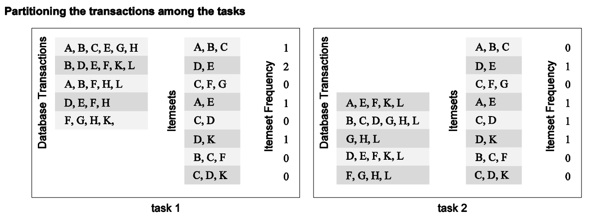
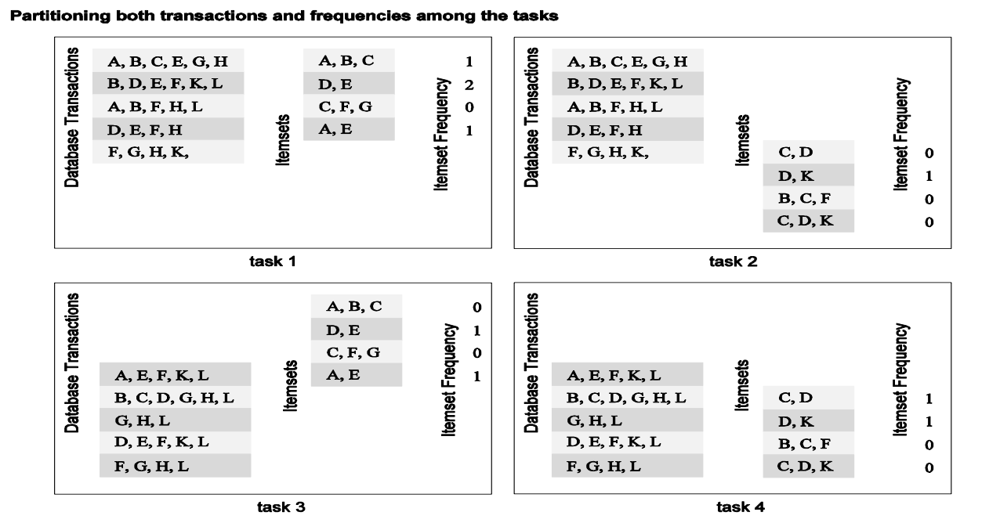

# 2. přednáška
## Tasky
- Při návrhu paralelního algoritmu musím prvně zadefinovat **tasky**, které se provádí paralelně
- Tasky se velikostně liší
- **Task dependency graph** - DAG - vyjadřuje závislost prováděných tasků
- **Granuality** - množství tasků, do kterých problém dekompunuju
- **Fine-grained decomposition** - velké množství tasků
- **Coarse grained decomposition** - malé množství tasků

## Pojmy
- **Degree of concurrency** - Počet tasků, které mohou být prováděny paralelně
- **Maximum degree of concurrency** - Maximální počet tasků, které mohou být prováděny paralelně
- **Average degree of concurrency** 
  - Průměrný počet tasků, které mohou být prováděny paralelně po dobu běhu algoritmu
  - Počet tasků / critical path length
- Degree of concurrency je závislé na granuality
- **Critical Path Length** - Nejdelší možná cesta, kterou běh algoritmu vykoná v rámci task dependency graphu
- Granualitu nelze snižovat do konečna - každý problém má *maximální možnou granualitu*
- Tasky spolu musí často komunikovat -> overhead - přílišná granualita nemusí být žádoucí

### Příklad

- (a)
  - Critical path length - 3 (4 nebo 3 -> 6 -> 7)
  - Shortest parallel execution time - 27
  - Processors count for minimum parallel execution time - 4
  - Maximum degree of concurrency - 4
  - Average degree of concurrency - 7/3 ❓
- (b)
  - Critical path length - 4 (2 nebo 1 -> 5 -> 6 -> 7)
  - Shortest parallel execution time - 28
  - Processors count for minimum parallel execution time - 2
  - Maximum degree of concurrency - 4
  - Average degree of concurrency - 7/4 ❓

## Task Interaction Graphs
- Graf komunikace tasků
- Tasky spolu často musí komunikovat (vyměňovat data), tuto komunikaci lze znázornit grafem

### Příklad
- Představme si násobení sparse matice **A** vektorem **b**
- Potřebujeme násobit pouze nenulové prvky z matice **A** (znázorněno černou tečkou)
- Každý task má přiřazen řádek matice **A** a jeden prvek vektoru **b**
- Např. pro provedení násobení prvního řádku se musíme doptat tasků 1,4,8 na jeho prvek z **b**, protože náš řádek zde obsahuje nenulové číslo a my ho potřebujeme vynásobit s příslušným prvkem z *b*, který náš task ale nezná

## Techniky dekompozice
Rozlišujeme čtyři základní techniky
1. [Recursive decomposition](#recursive-decomposition)
2. [Data decomposition](#data-decomposition)
3. [Exploratory decomposition](#exploratory-decomposition)
4. [Speculative decomposition](#speculative-decomposition)

### Recursive decomposition
- Vhodná pro problémy divide-and-conquer (eg. quick sort)
- Rekursivně dekomponujeme problém dokud nedosáhneme požadované granuality

#### Příklad
Quicksort
- Každý sub-list může být rekurzivně zpracováván paralelně

Hledání minima v listu
- Můžeme to pochopitelně dělat sériově
- Paralelně list 4,9,1,7,8,11,2,12 můžeme zpracovat následovně

### Data decomposition
- Spoléha na charakteristiku dat, s kterými algoritmus pracuje
- Dekompunujeme tyto data na jednotlivé tasky
- Volba dekompozice značně ovlivňuje výkon algoritmu
- Více přístupů
    1. Output data partitioning
    2. Input data partitioning
    3. Intermediate data partitioning

#### Output Data Decomposition
- Často může být element výsledku spočten nezávisle na ostatních výsledcích
- Pro stejný problém může existovat více output dekompozic

##### Příklad
Násobení dvou matic
- Každý výsledek **C** je nzávislý na ostatních **C**

Itemset
- Chceme spočítat počet výskytů itemsetu v databázi transakcí (a)
- To můžeme dekomponovat, tak že rozdělíme itemsety do více tasků (b)
- Nepotřebujeme žádnou komunikaci mezi tasky

#### Input Data Partitioning
- Použitelné, jestliže každý výstup je spočten jako funkce ze vstupu
- V mnoha případech jediná možná dekomnozice - nevíme co je výstup (např. hledání minima, sort listu)
- Tasku je přiřazena část vstupních data

##### Příklad
Itemset
- Rozdělíme databázi transakcí do více tasků
- Výsledky z jednotlivých tasků poté agregujeme do konečného výsledku

#### Input and Output Data Partitioning
- Kombinace obou přístupů

